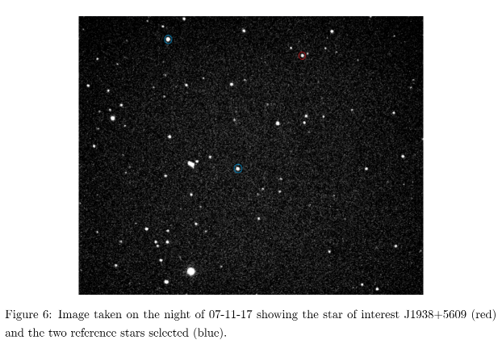
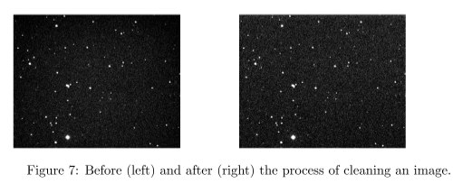
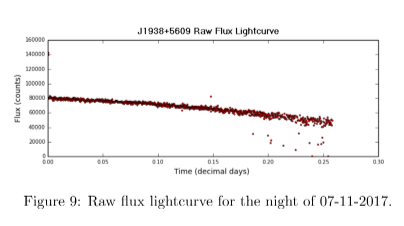

# Final_Year_Project

Example of the type of image to be processed and analysed. 
Includes 2 reference stars and the star to be studied, J1938+5609.

An example of the reduction process applied to each frame taken. 
Each frame firstly had a master bias frame subtracted from it, followed by being divided by a master flat field frame. 

The raw lightcurve produced from the pipeline after a night of observations.

The reference stars are used to normalize the raw lightcurve. As the stars move across the sky, refraction and interference through the atmosphere reduces the amount of light arriving at the sensor. Using reference stars helps in curbing this affect. 

A power spectrum produced from Analysis of the star J1938+5609. prewhitening was used to show the significance of the reduced peak. 
prewhitening is the process of subtracting a sin curve of a specific amplitude and frequency from a data set.
If a peak is easily removed and not made of multiple smaller peaks we can say that it is a fundamental mode of the star.

